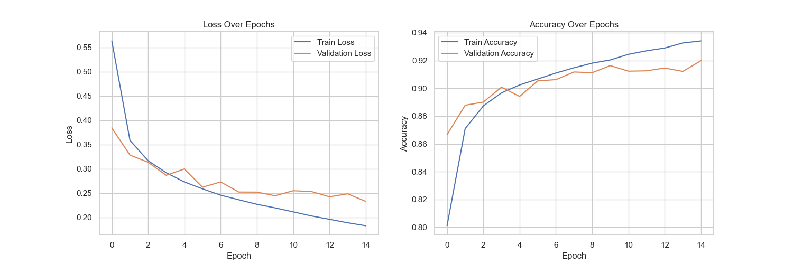
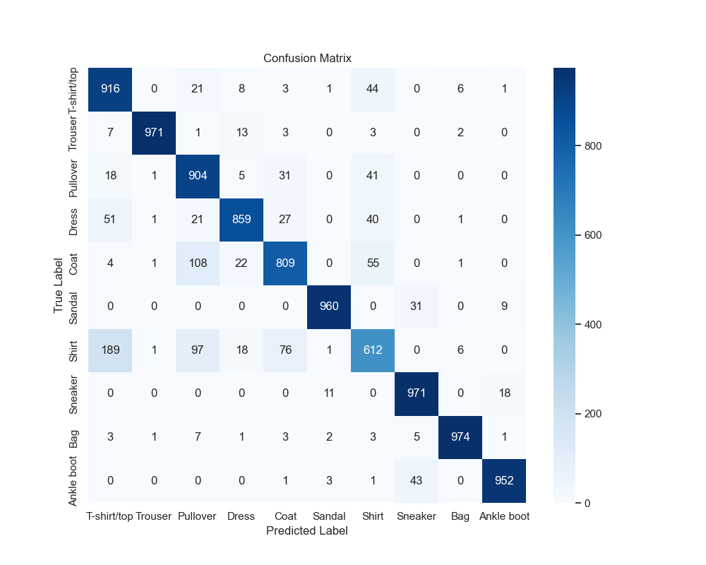

# End-to-End Garment Classifier for E-Commerce


## Project Overview

This project showcases the development of a deep learning model to accurately classify garment images from the FashionMNIST dataset into 10 distinct categories. As a data scientist for the fictitious e-commerce retailer, "Fashion Forward," the goal was to create a robust classifier to streamline product categorization, enhance search functionality, and improve inventory management.

The project follows a structured, end-to-end data science workflow, including:
- **Exploratory Data Analysis (EDA)** to understand dataset characteristics.
- **Iterative Model Development**, starting with a baseline and systematically improving performance.
- **Rigorous Evaluation** on a held-out test set to ensure real-world viability.
- **Code Refactoring** into a modular structure for maintainability and scalability.

## Key Results

The final model, a `DeeperCNN`, achieved a high accuracy on the unseen test set. The training history demonstrates stable learning and good generalization from the training to the validation set.

| Training History | Confusion Matrix |
| :---: | :---: |
| *The model shows stable learning without significant overfitting.* | *The confusion matrix highlights high performance across most classes.* |
|  |  |

## Methodology

### 1. Data Exploration and Preparation
The project began with an Exploratory Data Analysis (EDA) of the FashionMNIST dataset. The class distribution was analyzed to ensure a balanced dataset, which is crucial for training an unbiased model. The data was then prepared for modeling, which included creating separate training, validation, and test sets.


### 2. Iterative Modeling
An iterative approach was used to find the optimal model architecture:
1.  **Baseline CNN**: A simple, single-layer CNN was first trained for 5 epochs to establish a performance benchmark.
2.  **Extended Training**: The baseline model was then trained for 15 epochs, which showed improved accuracy but also signs of plateauing performance.
3.  **Deeper CNN with Dropout**: A more complex, two-layer CNN (`DeeperCNN`) was trained for 15 epochs. This model includes a **Dropout layer** for regularization to prevent overfitting. It captured more intricate features and yielded the best performance on the validation set.

### 3. Final Evaluation
The `DeeperCNN` was selected as the final model and evaluated on the held-out test set. The evaluation included overall accuracy and a confusion matrix to analyze class-specific performance and identify common misclassifications.

## Project Structure

The project is organized into a modular structure to promote code reusability and maintainability.

```
ecommerce_clothing_classifier/
│
├── ecommerce_clothing_classifier.ipynb # Jupyter Notebook for experimentation and analysis.
├── README.md                           # Project documentation.
├── fashion_mnist_cnn.pth               # Saved state dictionary for the final model (not tracked by Git).
├── predict.py                          # Script for making predictions with the trained model.
│
├── data/                               # Data storage (not tracked by Git).
├── figures/                            # Saved plots and visualizations.
│
├── src/                                # Refactored source code.
│   ├── data_loader.py                  # Function for loading and preparing data.
│   ├── model.py                        # CNN model definitions (Baseline and Deeper).
│   ├── train.py                        # Training and validation loop.
│   └── evaluate.py                     # Final model evaluation function.
│
└── tests/                              # Unit tests for the source code.
    ├── test_data_loader.py
    ├── test_evaluate.py
    ├── test_model.py
    └── test_train.py
```

## How to Run

To replicate the project and run the model, follow these steps:

1.  **Clone the repository:**
    ```bash
    git clone https://github.com/Zak-Las/Portfolio-DataProjects.git
    cd Portfolio-DataProjects/ecommerce_clothing_classifier
    ```

2.  **Create a virtual environment and install dependencies:**
    ```bash
    conda env create -f ../environment.yml
    conda activate Zak-Las
    ```

3.  **Run the notebook:**
    Open and run the `ecommerce_clothing_classifier.ipynb` notebook in a Jupyter environment to see the full analysis and model training process.

4.  **Make a prediction:**
    Use the `predict.py` script to classify a sample image using the saved model.
    ```bash
    python predict.py --image_path <path_to_your_image>
    ```

## Technologies Used

- **Python**
- **PyTorch**: For building and training the deep learning models.
- **scikit-learn**: For model evaluation metrics (e.g., confusion matrix).
- **Matplotlib & Seaborn**: For data visualization.
- **Jupyter Notebook**: For interactive development and analysis.

