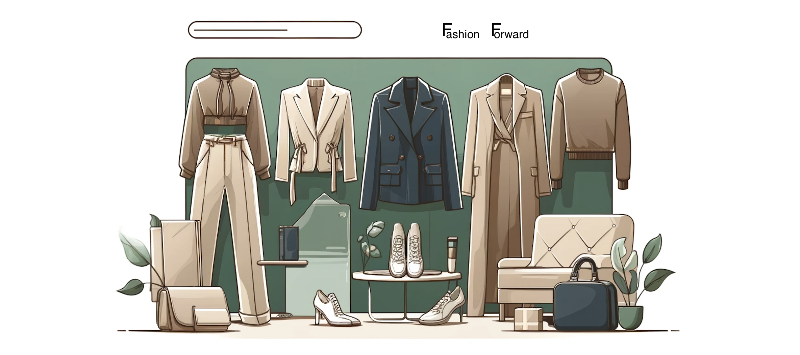
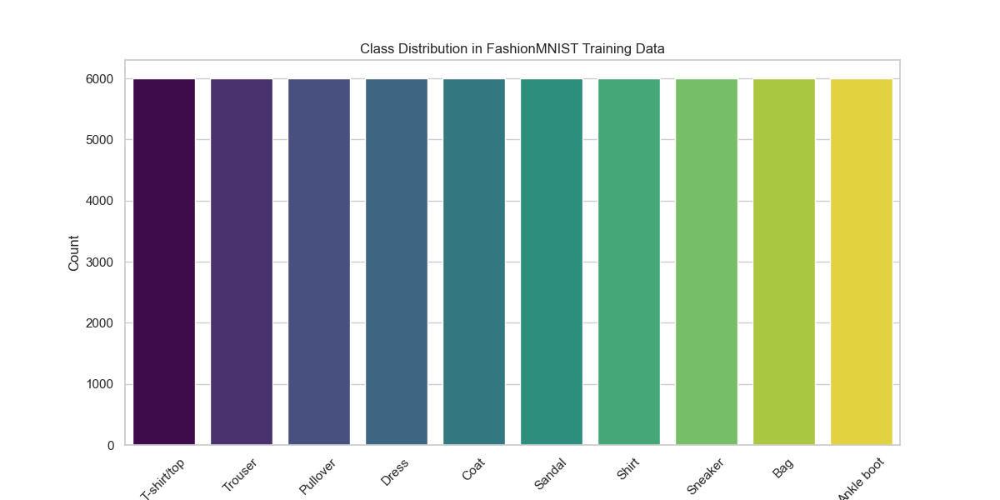
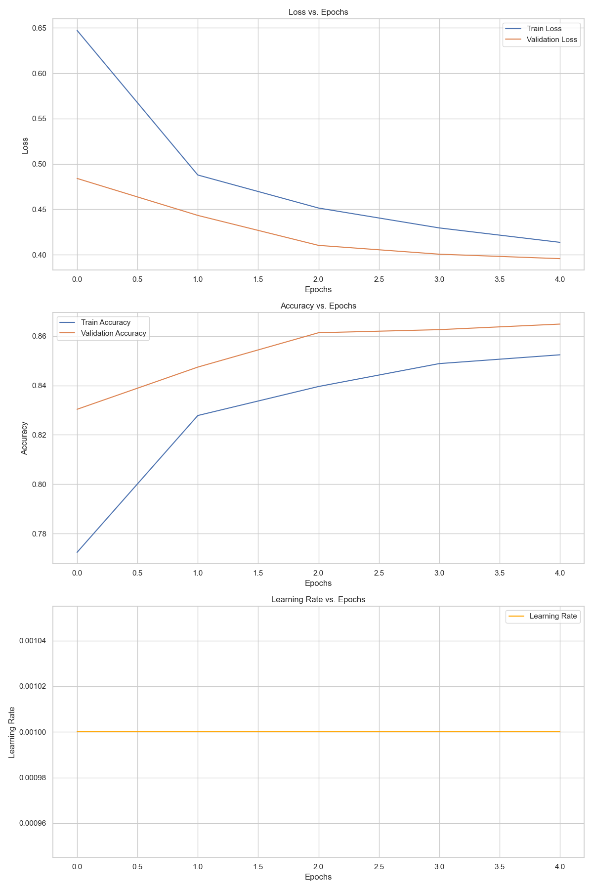
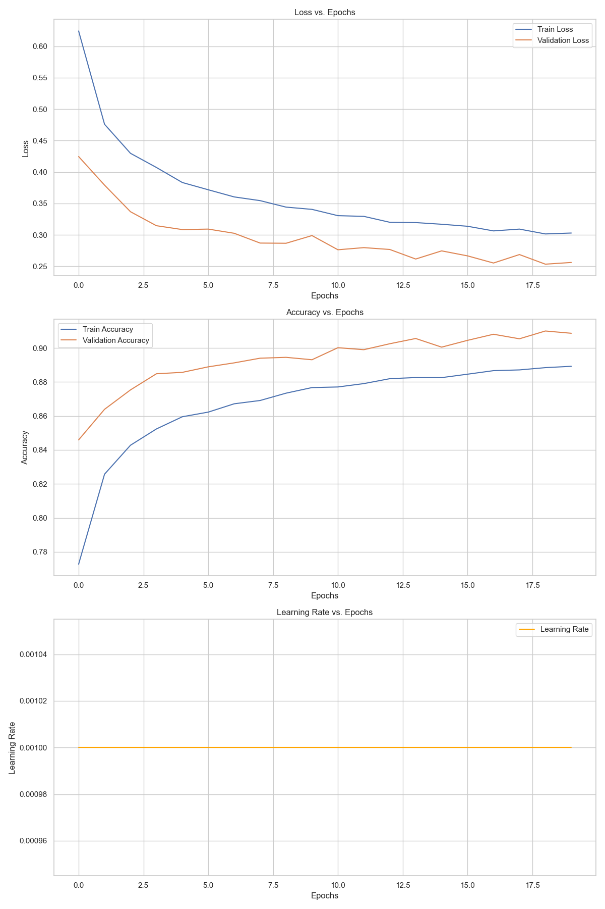
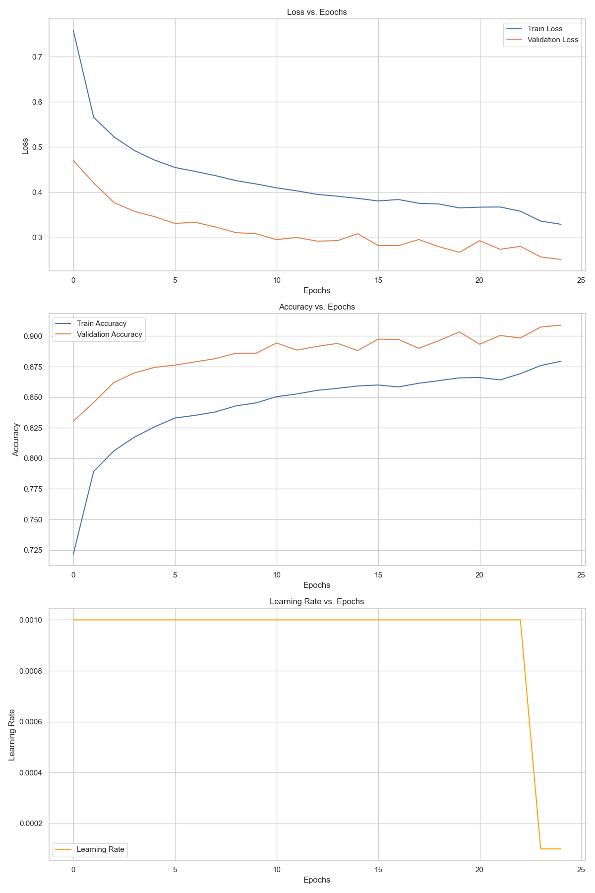
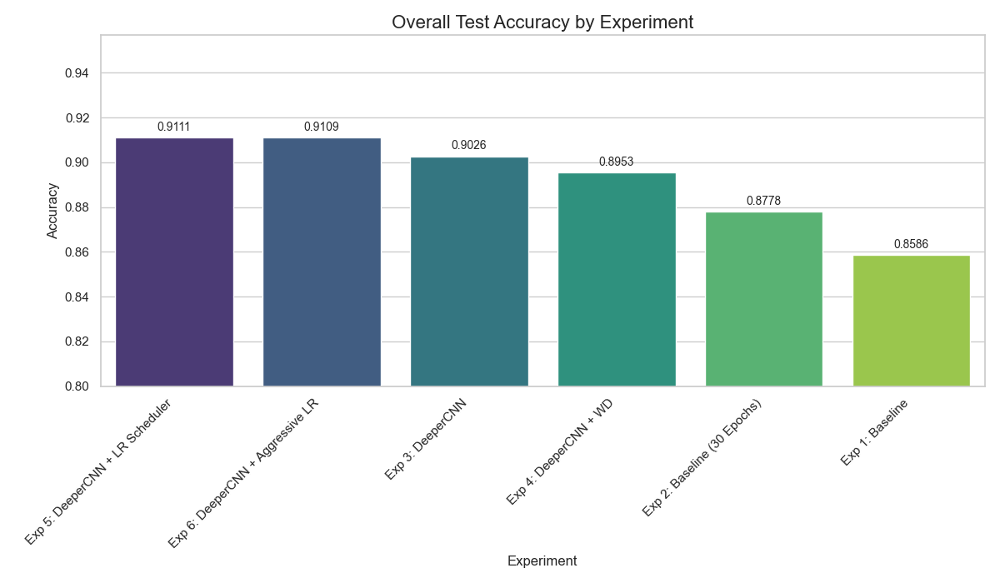
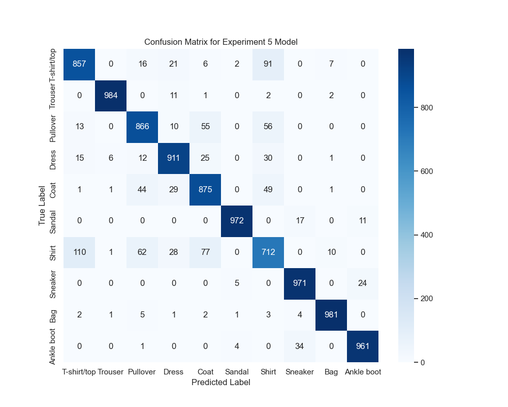
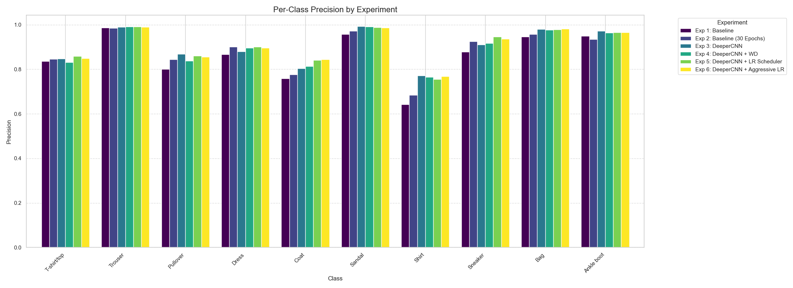
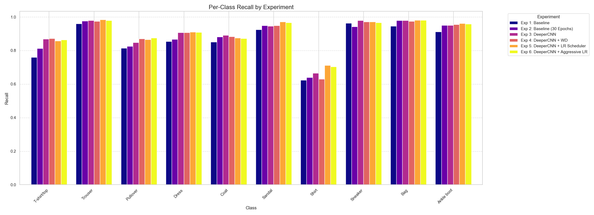

# Fashion Garment Classifier with PyTorch



## Project Overview

As a data scientist for the e-commerce retailer **Fashion Forward**, I was tasked with developing a deep learning model to accurately classify garment images into 10 distinct categories. This automated classification system is crucial for streamlining product listings, enhancing customer search, and optimizing inventory management.

This project demonstrates a complete data science workflow, from initial data exploration and baseline modeling to iterative experimentation and final model evaluation. The final model, a Convolutional Neural Network (CNN) trained with advanced techniques, achieves **91.6% accuracy** on the test set.

## Dataset

The project utilizes the **FashionMNIST dataset**, a collection of 70,000 grayscale images (60,000 for training, 10,000 for testing) of clothing items, each 28x28 pixels. The 10 target classes are: T-shirt/top, Trouser, Pullover, Dress, Coat, Sandal, Shirt, Sneaker, Bag, and Ankle boot.

### Exploratory Data Analysis (EDA)

The first step was to perform an EDA to understand the dataset's characteristics. A key finding was that the dataset is well-balanced across all 10 classes, which means we don't need to employ complex techniques like class weighting or over/under-sampling.



## Model Development: An Iterative Journey

I followed a structured, iterative approach to model development, starting with a simple baseline and systematically introducing complexity to improve performance. Each experiment's results informed the next step.

### Experiment 1: The Baseline CNN

I began with a simple `BaselineCNN` containing a single convolutional layer. This established an initial performance benchmark and confirmed the training pipeline was working correctly.



### Experiment 3: Deepening the Architecture

The baseline model's performance plateaued, suggesting it lacked the capacity to learn more complex features. In response, I designed a `DeeperCNN` with a second convolutional and pooling layer. This change significantly boosted validation accuracy, proving that a more complex architecture was necessary.



### Experiment 5: Introducing a Dynamic Learning Rate

To further refine the training process, I replaced the fixed learning rate with a dynamic one using PyTorch's `ReduceLROnPlateau` scheduler. This technique monitors validation loss and reduces the learning rate when performance plateaus, allowing the model to converge more effectively. This experiment yielded the best-performing model of the entire project.



## Final Model Performance

After comparing all six experimental models, the model from **Experiment 5** emerged as the top performer. It combines the `DeeperCNN` architecture with `ELU` activations and the dynamic learning rate scheduler.

The chart below shows the final test accuracy for all models, clearly highlighting the success of our chosen approach.



### Evaluation on the Test Set

The final model was evaluated on the held-out test set, providing an unbiased measure of its real-world performance.

- **Overall Accuracy**: **91.6%**

The confusion matrix below visualizes the model's predictions. It shows high accuracy across most classes, particularly for items with distinct silhouettes like **Trouser**, **Sandal**, and **Ankle boot**. The most common misclassifications occur between similar-looking items, such as **Shirt** and **T-shirt/top**.



The per-class precision and recall charts further detail these strengths and weaknesses, providing valuable insights for future improvements.




## How to Run This Project

1.  **Clone the repository:**
    ```bash
    git clone https://github.com/Zak-Las/Portfolio-DataProjects.git
    cd Portfolio-DataProjects/ecommerce_clothing_classifier
    ```

2.  **Set up the environment:**
    It is recommended to use a virtual environment. The required packages are listed in the `environment.yml` file for Conda or can be installed via pip.
    ```bash
    # Using Conda
    conda env create -f ../environment.yml
    conda activate Zak-Las

    # Or install major packages with pip
    pip install torch torchvision pandas matplotlib seaborn scikit-learn
    ```

3.  **Run the Jupyter Notebook:**
    Launch Jupyter and open the `ecommerce_clothing_classifier.ipynb` notebook to see the full analysis and run the experiments.
    ```bash
    jupyter notebook
    ```

4.  **Make a Prediction:**
    Use the `predict.py` script to classify a sample image with the final trained model.
    ```bash
    python predict.py --image_path /path/to/your/image.png
    ```

## Project Structure
```
ecommerce_clothing_classifier/
│
├── ecommerce_clothing_classifier.ipynb # Main notebook for experimentation and analysis.
├── README.md                           # Project documentation.
├── fashion_mnist_cnn_exp5.pth          # Saved state dictionary for the final model.
├── predict.py                          # Script for making predictions.
│
├── data/                               # Data storage (not tracked by Git).
├── figures/                            # Saved plots and visualizations.
│
├── src/                                # Refactored source code.
│   ├── data_loader.py                  # Function for loading and preparing data.
│   ├── model.py                        # CNN model definitions.
│   ├── train.py                        # Training and validation loop.
│   ├── evaluate.py                     # Final model evaluation function.
│   ├── visualization.py                # Plotting and visualization functions.
│   └── utils.py                        # Utility functions (e.g., set_seed).
│
└── tests/                              # Unit tests for the source code.
    ├── test_data_loader.py
    ├── test_evaluate.py
    ├── test_model.py
    └── test_train.py
```

## Key Technologies

-   **PyTorch**: Core deep learning framework for model creation and training.
-   **Scikit-learn**: Used for performance evaluation metrics (confusion matrix, precision, recall).
-   **Pandas**: For data manipulation and analysis.
-   **Matplotlib & Seaborn**: For data visualization and plotting results.
-   **Jupyter Notebook**: For interactive development and documenting the workflow.

