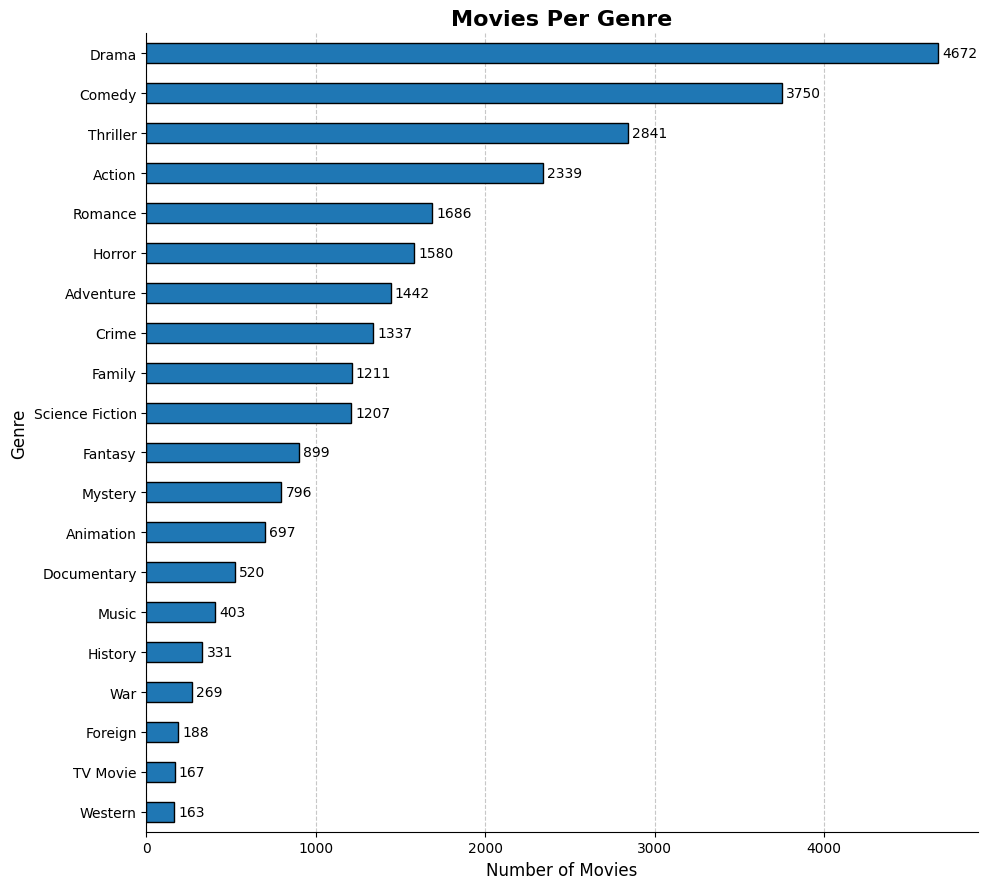
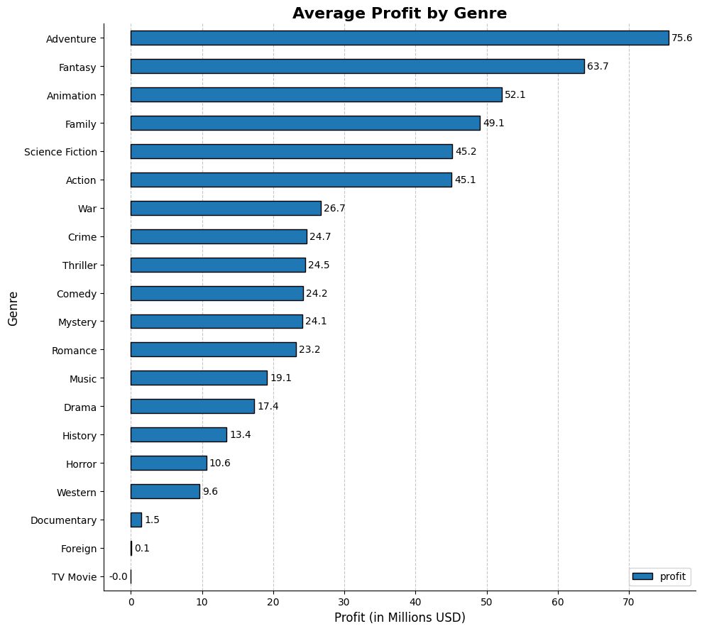
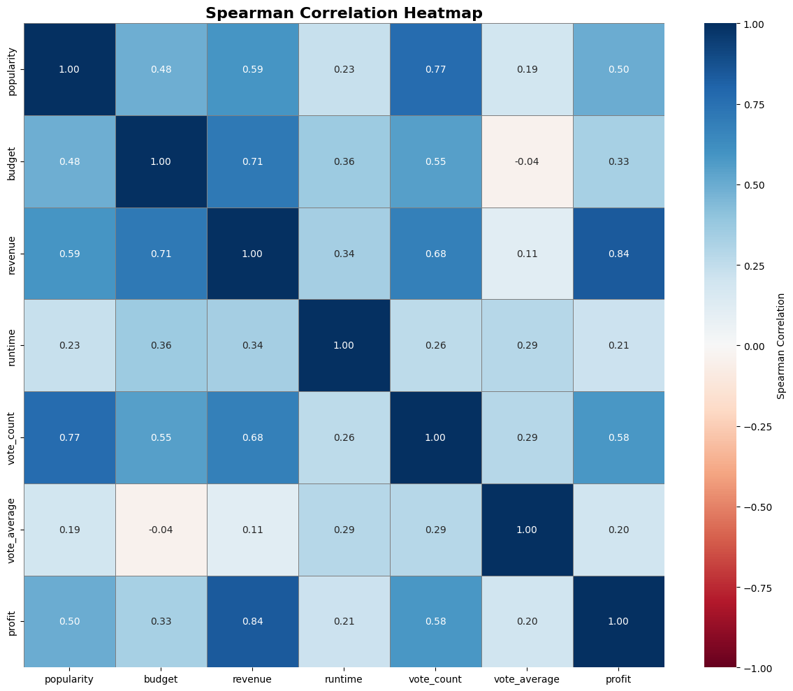

# Movie Industry Analysis: An Exploratory Data Analysis

## Project Overview

A hypothetical company is venturing into the movie industry and needs data-driven guidance to inform its strategy. This project involves a comprehensive exploratory data analysis (EDA) of an IMDb movie dataset to uncover insights into what makes a movie successful. The goal is to provide actionable recommendations to this new movie studio.

### Key Objectives:
-   Identify the most common and profitable movie genres.
-   Analyze the relationship between a movie's budget, revenue, and profit.
-   Investigate the correlation between audience ratings, popularity, and financial success.
-   Determine if certain genres consistently outperform others over time.

### Skills & Tools
-   **Data Manipulation:** `pandas`, `numpy`
-   **Data Visualization:** `matplotlib`, `seaborn`
-   **Core Python:** `datetime`

---

## Data Cleaning & Preparation

The initial dataset, `imdb_movies.csv` from Kaggle, required several cleaning and transformation steps:
1.  **Handling Missing Values:** Rows with missing `budget` or `revenue` data were dropped to ensure the integrity of financial calculations.
2.  **Data Type Conversion:** `budget` and `revenue` columns were converted to numeric types.
3.  **Feature Engineering:**
    -   A `profit` column was created (`revenue` - `budget`).
    -   The `genres` column, which contained multiple genres in a single string, was split to analyze each genre individually.
4.  **Outlier Removal:** Initial plots revealed movies with zero budget or revenue, which were treated as data errors and removed from the dataset to avoid skewing the analysis.

---

## Exploratory Data Analysis & Findings

### Q1: Which movie genres are the most common?

By grouping the data by genre, it's clear that a few genres dominate the landscape.

  

**Finding:** `Drama`, `Comedy`, and `Thriller` are the three most frequently produced movie genres, accounting for over 40% of the films in this dataset.

### Q2: Which genres are the most profitable and have the highest investment?

Analyzing the average budget, revenue, and profit per genre reveals a clear winner.

  

**Finding:** The `Adventure` genre consistently ranks highest in terms of average budget, revenue, and, consequently, profit. This suggests that while adventure films are expensive to make, they have the potential for the highest returns.

### Q3: What is the relationship between budget, popularity, ratings, and profit?

To understand the drivers of financial success, I examined the correlations between several key metrics.

  

**Findings:**
-   **Profit and Revenue:** There is a very strong positive correlation (0.84) between a movie's revenue and its profit, which is expected.
-   **Profit and Budget:** A moderate positive correlation (0.33) exists between budget and profit. Higher budgets don't guarantee higher profits, but they are related.
-   **Profit and Popularity:** Popularity has a stronger correlation with profit than budget does, indicating its importance in driving financial success.
-   **Profit and Ratings (`vote_average`):** The correlation between audience rating and profit is weak but positive (0.19). A good movie doesn't always mean a profitable one, but it helps.

The scatter plot below visualizes the weak but positive trend between a movie's rating and its profit.

### Q4: Do some genres consistently underperform?

By plotting the average profit for each genre over the years, we can identify long-term performance trends. The heatmap below shows average profit by genre and year (Green for profit, Red for loss).

  

**Finding:** Yes, performance trends are visible over decades. Genres in the top third of the plot (like `Adventure`, `Animation`, `Fantasy`) have been consistently profitable, especially between 2010 and 2015. Conversely, genres in the bottom third (like `Horror`, `Thriller`) have frequently booked losses or only marginal profits.

---

## Recommendations for the New Studio

Based on this analysis, here are my recommendations for the new movie studio:

1.  **Focus on High-Performing Genres:** Prioritize investment in `Adventure`, `Animation`, and `Fantasy` films. These genres have demonstrated the highest potential for large profits, despite requiring significant initial budgets.

2.  **Balance the Portfolio with "Safer" Bets:** While `Drama` and `Comedy` are the most common genres, their profitability is moderate. The studio could produce these as lower-budget films to balance the high-risk, high-reward adventure movies.

3.  **Marketing is Key:** The analysis shows that `popularity` is a strong indicator of profit. The studio should invest heavily in marketing and building buzz to maximize a film's financial success.

4.  **Avoid Consistently Underperforming Genres:** Be cautious when considering genres like `Horror` or `Thriller`. While they have a lower barrier to entry (lower budgets), they have historically underperformed in terms of profitability. A strong, unique concept would be required to succeed in these areas.

5.  **Quality is a Factor, but Not the Only One:** While high ratings are desirable, they don't guarantee profit. The focus should be on creating popular, marketable films that resonate with a broad audience, rather than solely chasing critical acclaim.