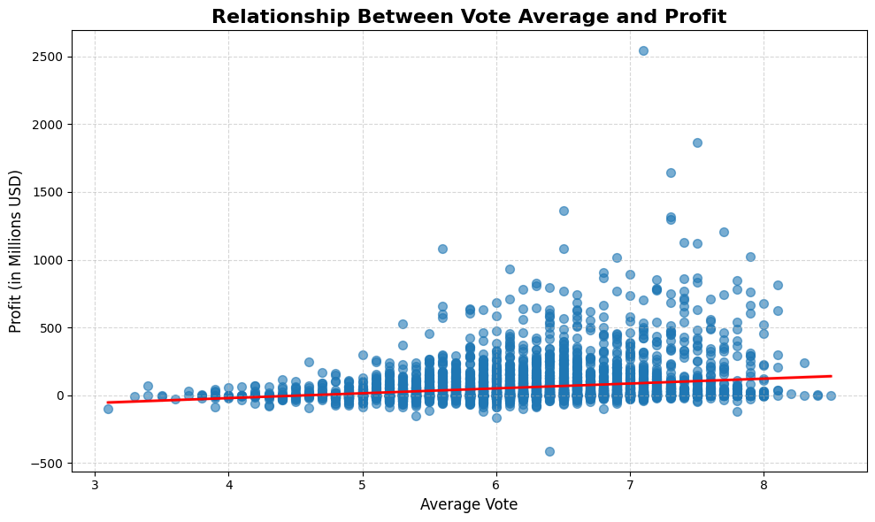

# Project Summary

*A hypothetical company has announced its intention to enter the movie industry by establishing a new studio. While the company currently lacks experience in this field, my objective is to gather, clean, and analyze movie-related data from a variety of sources in order to provide informed recommendations that can support their success in this new venture.*


## Skills Used
### *pandas, numpy, seaborn, matplotlip, datetime*


## Exploratory Data Analysis

### - Dataset <br />

The database **`imdb_movies.csv`** was obtained from Kaggle. Creadit to [HARSHIT SHANKHDHAR](https://www.kaggle.com/datasets/harshitshankhdhar/imdb-dataset-of-top-1000-movies-and-tv-shows).

### - Research Questions:

1. Which genres are the most common?
2. Which genres rank top in terms of investement and return?
3. Which genres rank top in terms of ticket sales?
4. Which genres rank top in terms of high ratings (voting avgerage above 8)?

### - Research Hypotheses:

1. The best movies according to the rating votes return high profits.
2. The top movies in terms of ticket sales return high profits.
3. The movies with the biggest budgets tend to generate high revenue and profit.
4. The movies with the biggest budgets tend to rank high on popularity.

## Question 1: Which genres are the most common?

To answer this question, I create a dataframe where I group by the genre of each movie and order to the output by the unique count of each movie title.
```
genres_count = pd.DataFrame(movies_genre.groupby('genres_split').original_title.nunique()).sort_values('original_title',ascending = True)
```

Then, I generate a pie chart showing each genre and its percentage with respect to the entire dataset.

<!--  -->

<p align="center">
  
</p>

Also, one can generate a horizontal bar chart to see the count for each genre.

<!--  -->
<p align="center">
  
</p>

**Conclusion of Question 1:** From the plots above, one can see that the top 3 genres are `Drama`, `Comedy`, and `Thriller`, respectively. These three genres count more than 40% of all movies.

## Question 2: Which genres rank top in terms of investement and return?

To answer this question, I create a new datafram where I group the data by the genre (similar to the way I answered question 1). However, this time, I compute the `.mean()` for the remainig columns. Of course, the columns that contain string values cannot be included in the calculation of the mean.

Now, I generate a horizontal bar chart that depicts both the average budget and revenue of each movie genre. In the figure below, the genres are sorted by the revenue in a descending order from top to bottom.


<p align="center">
  
&nbsp; &nbsp; &nbsp; &nbsp;
  
</p>


Also, for completeness, I generate the same figure as above, but this time I sort the different gernes by their budget in a descending order as well.

<!--  -->
<!--  -->

**Conclusion of Question 2:** The movie genre `Adventure` ranks top with respect to both metrics: revenue and budjet. 

## Question 3: Which genres rank top in terms of profts?

To answer this question, I append to the table a new column. Namely, I will calculate the profits earned by each movie. This can be implemented by running the line of code below:

```
movies['profit'] = movies['revenue'] - movies['budget']
```

Basically, the profits are computed by subtracting the budget from the revenue of each movie. This calculation can done at the fine level or could be coarse-grained by grouping over the movie genre and averaving both the budget and revenue of each movie each genre group. 

Now, I generate horizontal bar chart showing the new calculated values (profits) for each movie genre.

<p align="center">
  
</p>
<!--  -->

**Conclusion of Question 3:** The movie genre `Adventure` ranks top in terms of average profits. This observation aligns logically with the answer of **question 2**. In shot, movies of the `Adventure` genre tend to have the biggest budgest and yeild the highest returns which translate to the largest average profits.

## Question 4: Which genre ranks top in terms of popularity?

To answer this question, I generate a plot showing the average popularity per movie genre.

<p align="center">
  
</p>

<!--  -->

**Conclusion of Question 4:** The movie genre `Adventure` ranks top with respect to the `popularity` metric.

## Question 5: Which genre ranks top in terms of rating (including only movies with average rating ≥ 8/10)?

The rating of each movie takes place by recording individual votes with a score between between 0 and 10 (10 is the best). Then all the votes are averaged out into a final reading. This is done for each movie. Then, because I grouping the data by genre, a second average is computed across each genre. 

To answer **question 5**, I will take two paths. The average In the fist path, I will take into account all the available values in the dataset. In the second path, I will filter out all movies that have less than 50 votes. The movies low `vote_count` might stand out as outliers. My worry here is that the order of genres will be different depending on the low `vote_count` instances being include or excluded.

I will add another condition to filter the data set. Namely, I will exclude all movies that have an average rating below 8, regardless of their `cote_count`.

First, I take into account all the available data and generate a chart showing the average rating per movie genre.


<p align="center">
  
&nbsp; &nbsp; &nbsp; &nbsp;
  
</p>


Also, I generate the same chart with the additional constraint filtring out all the instances where `vote_count` is below 50.


**Conclusion of Question 5:** The two charts illustrated above show a different order of movie genres. This confirms my initial suspicion. When all instances are included the top 3 genres read `Mystry`, `Music`, and `Documentary`. However, when only the instances with `vote_count` at or above 50 are included, the top 3 genres seem to become `Documentary`, `Crime`, and `Adventure`. The second order makes more sense. 

My choise of making the cutoff at 50 votes was made to show a concrete example where data might be insufficiently large. Identifying the cuttoff with a more rigourous method will be needed for deeper analysis. Alternatively, when computing the average rating per gernre, one could use the `vote_count` as wheight for the rating of each movie title.


## Hypothesis 1: The best movies according to the rating votes return high profits.

To confirm the hypothesis above, I genererate a table of correlations between all the columns. To this end, I use the method `.corr(method = 'spearman')` which outputs the values below:


While the correlations between the columns `profit` and `vote_average` seems to be low, it is still on the positive side. One can generate a scatter plot showing all the instances and who they are positioned in terms of average rating and recorded profits.



**Conclusion of Hypothesis 1:** One can ses in the plot above, and also the table of correlations, that the average ratings has a weak yet positive correlation with the profit made by each movie. In the figure above, the trendline (depicted in red) show sligh increase in profits when the voting average increases.
It might be also useful to note that in the range above 6 for the vote average, the number of outliers is visibility more imported and that there is an upwards bias. In other words, there are more movies above and far from the red trendline. A similar behaviour can be observed when the `revenue` is scatter plotted against the `vote_average`(see the plot below). A deeper analysis is needed to understand the most important metrics for the success of each movie.


## Hypothesis 2: The top movies in terms of ticket sales return high profits.

Regarding this hypothesis, I am more optimistic to find stronger evidence of its validity. By looking at the correlation table above, one can see that the `profit`column has a stronger correlation with the `revenue` column. (The correlation metric scores 1 for maximum correlations while 0 means that the two columns are perfectly independent of each other.) In the previous example, I considered the `profit` and `vote_average` columns. This pair scored a shy 0.19. On the other hand, **Hypothesis 2** considers a different pair, i.e. the  `profit` and `revenue` columns. This pair scored higher at 0.84. 

Now, I generate a scatter plot showing the populatirity and profits for each movie in the dataset.

<p align="center">
  
</p>

<!--  -->

**Conclusion of Hypothesis 2:** The figure above illustrates a positive correlation between profits and the popularity of the movies. This correlation is much stronger than the one observed between the `profit` and `vote_average` columns.

## Hypothesis 3: The movies with the biggest budgets tend to generate high revenue and profit.

From the table of correlations, one can see that the pair of columns `profit` and `budget` scored 0.33. The pair (`budget`, `revenue`) scored 0.71. I generate two scatter plots showing the both pairs of metrics.

<!--  -->

<p align="center">
  
&nbsp; &nbsp; &nbsp; &nbsp;
  
</p>

**Conclusion of Hypothesis 3:** The figure above illustrates a positive correlation between budget and the profit and the revenue.  

## Hypothesis 4: Some genres consistently underperform.

To test this hypothesis, I generate a plot showing the average profits made for each genre and for each year. There are 3 plots that show the same data but with different color codes. 

- The plot on the left, has a continus color code. It spans the range between -100 million USD and +250 million USD. 
- The plot on the right has a bichromatic color code. If the average profit value is above 0, the corresponding color is green. If the average profit value is negative (recorded loss), then the color shows as red.
- The plot in the middle has a trichromatic color code. Basically, it is the same as the plot on the right in addition to a third case. When profits are positive and small (between 0 and 50 million USD), the color shows as grey. 


<p align="center">
  
&nbsp; &nbsp; &nbsp; &nbsp;
  
&nbsp; &nbsp; &nbsp; &nbsp;
  
</p>

**(These are identical plots but with different color codes)**


The genres have been ordered with respect to their average profits from 2015. This unravels an interesting pattern. 
- The genres that are depicted in the top 1/3 of the figure tend to overperform. Between 2010 and 2015, these genres consistently recorded profits above 50 million USD.
- The genres that are depicted in the bottom 1/3 of the figure tend to underperform. Across all the available data, with a few exceptions, these genres have been either booking losses or small profits (below 50 million USD).

**Conclusion of Hypothesis 4:** The figure above shows that the performance of different movie genres fluctuates slowly over the decades of recorded data. Indeed, some genres seem to underperform the rest. 